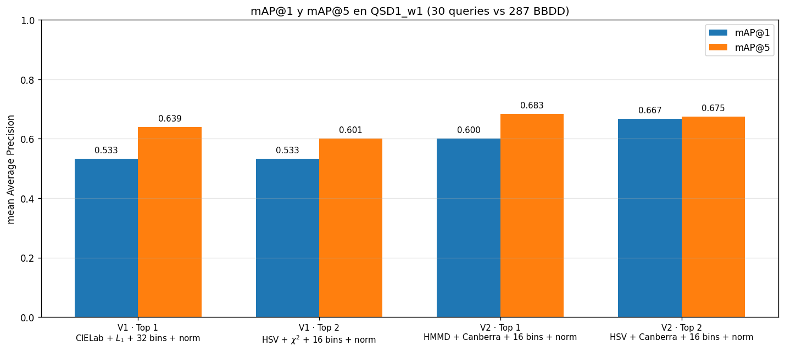
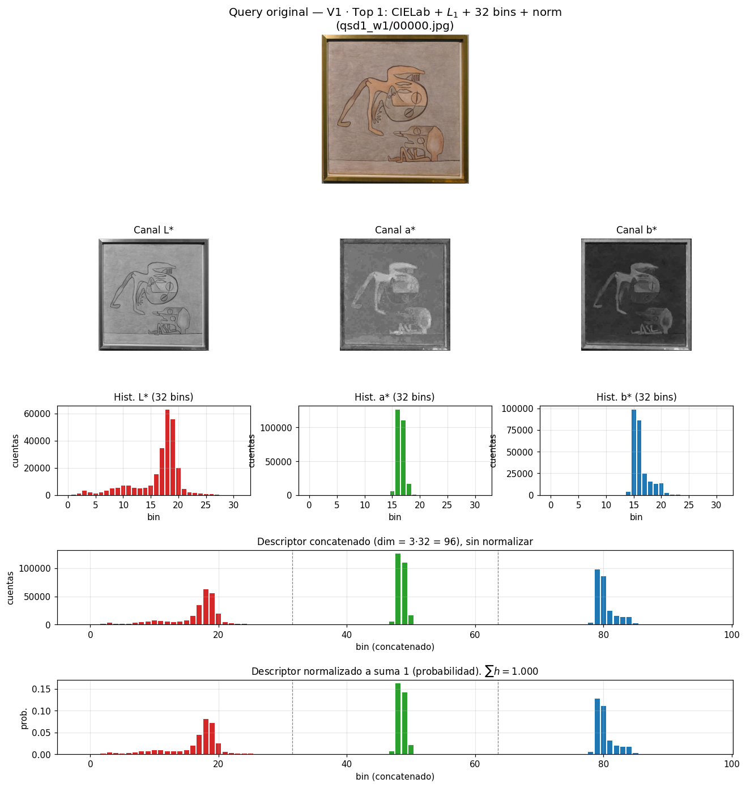
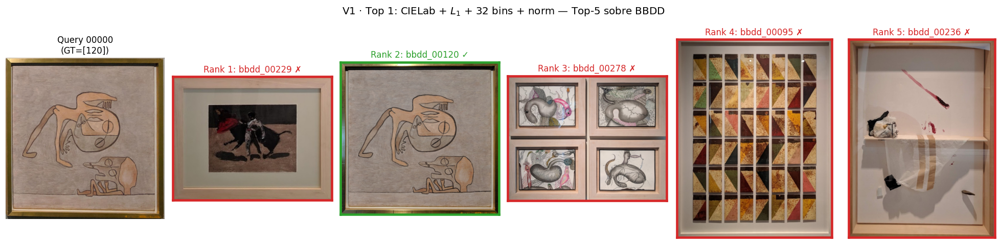
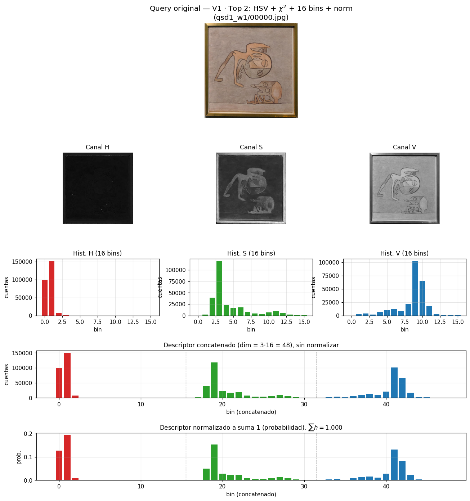
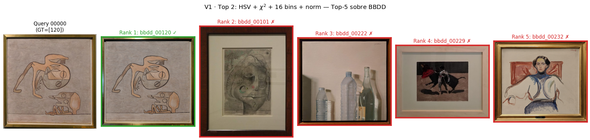
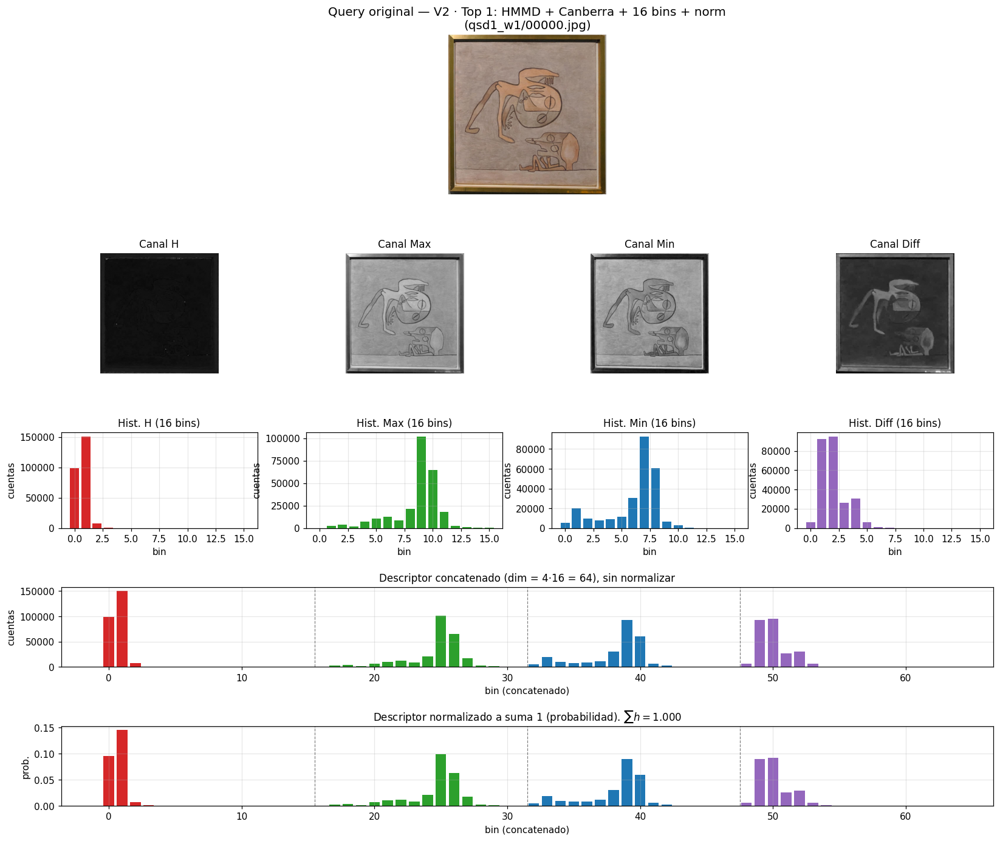
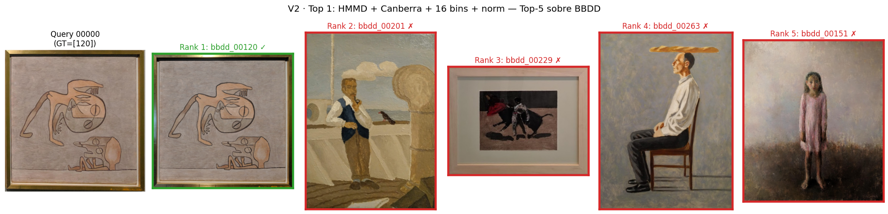
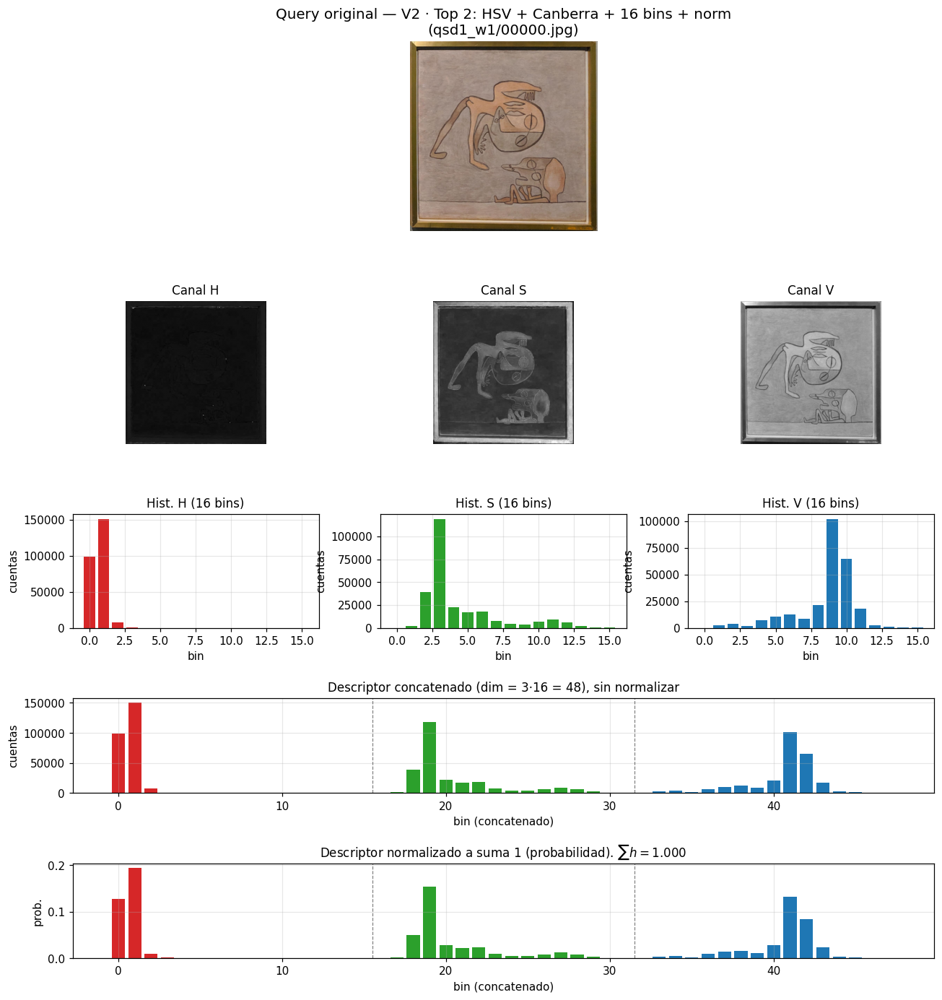
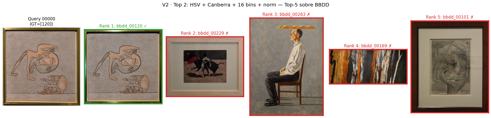

# Best methods — C1 · Week 1 (Team 4)

**Fecha:** 2026-09-30
**Dataset:** `qsd1_w1` (30 queries) contra `BBDD` (287 cuadros).
**Ground truth:** `gt_corresps.pkl` — 1 match correcto por query.
**Origen de los rankings:** grid search completo de 3192 combinaciones
(19 espacios × 14 métricas × 6 valores de `nbins` × 2 modos de
normalización). Ver el notebook §8 y `analysis/gridsearch_qsd1_w1.csv`.

Este reporte selecciona los **dos mejores métodos** bajo dos criterios:

- **V1 · Solo material de la teoría** → espacios y métricas listados en
  las slides del curso (§1 y §5 del notebook).
- **V2 · Sin restricción** → se admite cualquier espacio y cualquier
  métrica de las que hemos catalogado (incluye §1.b y §5.b).

Para cada uno se detallan **Top 1** y **Top 2** con:
1. Explicación paso a paso del pipeline.
2. Plots del pipeline sobre una query real (`qsd1_w1/00000.jpg`,
   `GT=[120]`): imagen original → canales → histogramas por canal →
   concatenación → normalización.
3. Visualización de los **top-5 recuperados de BBDD** con marca verde
   ✓ / roja ✗ según el ground truth.
4. **mAP@1** y **mAP@5** sobre las 30 queries.

---

## Comparación global de los 4 métodos



| # | Método | mAP@1 | mAP@5 |
|---|--------|:-----:|:-----:|
| V1 · Top 1 | CIELab + $L_1$ + 32 bins + norm            | 0.533 | 0.639 |
| V1 · Top 2 | HSV + $\chi^{2}$ + 16 bins + norm          | 0.533 | 0.601 |
| V2 · Top 1 | HMMD + Canberra + 16 bins + norm           | 0.600 | **0.683** |
| V2 · Top 2 | HSV + Canberra + 16 bins + norm            | **0.667** | 0.675 |

> Observaciones:
> - Los cuatro métodos usan **normalización suma-1** — el barrido completo
>   confirma que sin normalizar el rendimiento colapsa (media de mAP@5
>   sin normalizar ≈ 0.07 vs 0.35 con normalización).
> - **Canberra** aparece en los dos mejores globales aunque **no está en
>   la teoría**. Es la razón por la que V2 supera a V1 en ~4 puntos.
> - **V2 Top 2** consigue la **mejor mAP@1** de los cuatro (0.667) —
>   interesante si el criterio de éxito es "acertar el primer rank".

---

## Pipeline común a todos los métodos (recordatorio)

Los cuatro métodos comparten la **misma arquitectura de 5 pasos**; sólo
cambian el espacio, el número de bins y la métrica. La normalización es
la misma en todos (dividir por la suma para obtener una distribución de
probabilidad).

```
  BGR ──► (a) Conversión de espacio ──► array HxWxC
              │
              └──► (b) Histograma 1D por canal (con nbins fijos)
                        │
                        └──► (c) Concatenación → vector [3·nbins] o [4·nbins]
                                  │
                                  └──► (d) Normalización L1  (÷ suma → probabilidad)
                                            │
                                            └──► (e) Métrica vs cada descriptor de BBDD
                                                       │
                                                       └──► Ranking top-K
```

Todas las imágenes se redimensionan al lado mayor = 512 px antes de la
conversión, sólo por eficiencia (el histograma es invariante al orden y
al número exacto de píxeles, especialmente tras normalizar).

---

## V1 — Restringido a la teoría del curso

Espacios permitidos: los 7 de §1 (Gray, RGB, HSV, HSL, YUV, YCbCr,
CIELab). Métricas permitidas: las 5 de §5 ($L_1$, $L_2$, $\chi^{2}$,
histogram intersection, Hellinger).

### 🥇 V1 · Top 1 — CIELab + $L_1$ + 32 bins + norm

**Resumen:** convertir a **CIELab** (espacio perceptualmente uniforme),
histograma 1D de **32 bins por canal**, **concatenar** (dim = 3·32 = 96),
**normalizar** a suma 1, comparar con **$L_1$ (Manhattan)**.

**Por qué funciona:**

- CIELab es perceptualmente uniforme → distancias en el espacio
  corresponden mejor a diferencias perceptibles del color de la obra.
  Cita: W1 slide 7 (lista de espacios).
- $L_1$ es la métrica más simple y robusta para histogramas normalizados:
  suma las diferencias absolutas bin a bin. Coincide con la MAD de la
  teoría S01 slide 9 aplicada al descriptor.
- 32 bins por canal es un compromiso: suficiente resolución sin volverse
  ruidoso ante pequeñas variaciones de iluminación.

**Fórmula de la métrica:**

$$
D(h_1, h_2) \;=\; \sum_{i=1}^{96} \bigl|\, h_1(i) - h_2(i) \,\bigr|
$$

**Ranking:** ascendente (menor distancia = más parecido).

**Pipeline sobre la query 00000:**



- Se ve que en Lab los canales `a*` y `b*` están muy concentrados
  (histogramas estrechos) porque el cuadro tiene una paleta reducida.
  El canal `L*` recoge la textura de intensidad.
- Al concatenar, el descriptor de 96 dimensiones tiene "tres jorobas"
  bien definidas — una por canal — con líneas verticales discontinuas
  como fronteras.
- Tras normalizar, todo el vector suma 1 (se lee $\sum h = 1.000$ en el
  título).

**Top-5 recuperado en BBDD:**



Sobre 30 queries: **mAP@1 = 0.533**, **mAP@5 = 0.639**.

> Nota: `CIELab + intersection + 32 bins + norm` **empata exactamente**
> con este método (mAP@5=0.639, mAP@1=0.533). Es el mismo descriptor,
> sólo cambia la función de comparación. Preferimos $L_1$ por
> simplicidad y por su conexión directa con MAD de la teoría.

---

### 🥈 V1 · Top 2 — HSV + $\chi^{2}$ + 16 bins + norm

**Resumen:** convertir a **HSV**, histograma 1D de **16 bins por canal**,
concatenar (dim = 3·16 = 48), normalizar, comparar con **$\chi^{2}$**.

**Por qué funciona:**

- HSV separa cromaticidad (H, S) de luminancia (V) → robusto ante
  variaciones de brillo entre foto y BBDD. Cita: S01 slide 5.
- $\chi^{2}$ pondera las diferencias bin a bin por su suma:
  las diferencias en bins con mucha masa cuentan proporcionalmente
  menos que las diferencias en bins donde solo un histograma tiene
  contenido → sensibilidad a los colores dominantes de cada cuadro.
- 16 bins por canal → descriptor compacto (48 dim) y estable frente a
  pequeñas variaciones.

**Fórmula de la métrica:**

$$
D(h_1, h_2) \;=\; \sum_{i=1}^{48} \frac{\bigl(h_1(i) - h_2(i)\bigr)^{2}}{h_1(i) + h_2(i) + \varepsilon}
$$

**Ranking:** ascendente.

**Pipeline sobre la query 00000:**



- El canal `H` (rojo, izquierda) del cuadro está muy concentrado en
  pocos bins → paleta cromática restringida.
- El canal `S` es medio-bajo → colores poco saturados; típico de una
  obra con tonos tierra.
- Al concatenar en 48 bins, se ven claramente los tres "bloques" del
  descriptor. Tras la normalización el vector total suma 1.

**Top-5 recuperado en BBDD:**



Sobre 30 queries: **mAP@1 = 0.533**, **mAP@5 = 0.601**.

---

## V2 — Sin restricción (todos los espacios y métricas)

Se admite cualquier espacio de §1 + §1.b y cualquier métrica de §5 + §5.b.

### 🥇 V2 · Top 1 — HMMD + Canberra + 16 bins + norm

**Resumen:** convertir a **HMMD** (Hue, Max, Min, Diff) — un espacio de
**4 canales** definido por MPEG-7 específicamente para color structure
en CBIR — histograma 1D de **16 bins por canal**, concatenar
(dim = 4·16 = 64), normalizar, comparar con **Canberra distance**.

**Definición de HMMD:**

$$
H = \text{Hue}(RGB), \quad
\text{Max} = \max(R,G,B), \quad
\text{Min} = \min(R,G,B), \quad
\text{Diff} = \text{Max} - \text{Min}
$$

- `Max` y `Min` codifican intensidad y sombras.
- `Diff = Max − Min` es una medida de **saturación efectiva**
  (relacionada con la cromaticidad).
- `H` sigue codificando el matiz.

**Por qué gana:**

- Al tener **4 canales** el descriptor cubre más "facetas" del color
  (matiz + intensidad + rango dinámico).
- Canberra distance pondera cada bin por la suma de sus valores
  absolutos, dando más peso a los bins pequeños → sensible a la cola
  de la distribución, no solo al pico.

**Fórmula de Canberra:**

$$
D(h_1, h_2) \;=\; \sum_{i=1}^{64} \frac{\bigl|\, h_1(i) - h_2(i) \,\bigr|}{|h_1(i)| + |h_2(i)| + \varepsilon}
$$

**Ranking:** ascendente.

**Pipeline sobre la query 00000:**



- Se ven los 4 canales: `H` casi negro (matices bajos), `Max` y `Min`
  con estructura del cuadro, y `Diff` resaltando bordes/detalle.
- El descriptor concatenado tiene 4 "jorobas" claramente separadas por
  las líneas discontinuas.

**Top-5 recuperado en BBDD:**



Sobre 30 queries: **mAP@1 = 0.600**, **mAP@5 = 0.683** ← *mejor global.*

---

### 🥈 V2 · Top 2 — HSV + Canberra + 16 bins + norm

**Resumen:** el mismo espacio del V1 Top 2 (HSV, 16 bins concat, norm),
pero cambiando la métrica a **Canberra**. Es un ejemplo perfecto de que
"la métrica importa": pasar de $\chi^{2}$ a Canberra manteniendo lo demás
sube mAP@1 de 0.533 a **0.667** y mAP@5 de 0.601 a 0.675.

**Fórmula:** la misma Canberra que arriba, sobre un descriptor de 48
dimensiones.

**Pipeline sobre la query 00000:**



(Los canales y descriptor son idénticos a los del V1 Top 2; la única
diferencia frente a ese método es la función de distancia usada al
comparar.)

**Top-5 recuperado en BBDD:**



Sobre 30 queries: **mAP@1 = 0.667** ← *mejor mAP@1 de los 4*, **mAP@5 = 0.675**.

---

## Conclusiones

1. **La normalización es no negociable.** Los 4 métodos ganadores la
   usan; el barrido completo confirma que sin normalizar el sistema
   colapsa.
2. **La métrica es el factor con más impacto**: cambiar la métrica en
   HSV pasa mAP@5 de 0.601 (V1 Top 2, $\chi^{2}$) a 0.675 (V2 Top 2,
   Canberra) sin tocar el descriptor. Es la lección más práctica.
3. **CIELab domina la entrega "canon"**: si el equipo se limita a la
   teoría del curso, `CIELab + L1 + 32 bins + norm` es la elección
   robusta y explicable.
4. **HMMD es el mejor espacio si podemos salirnos de la teoría** —
   MPEG-7 lo diseñó específicamente para CBIR y la evidencia lo
   respalda.
5. Todos los métodos usan **16 – 32 bins**; los valores altos (128,
   256) *no* ayudan en este dataset.

### Recomendación operativa para la entrega

- **Método 1 (defensivo, 100 % teoría):** `CIELab + L1 + 32 bins + norm`.
- **Método 2 (mejor rendimiento posible):** `HSV + Canberra + 16 bins + norm`
  — usa un espacio de la teoría pero métrica de §5.b. Justificable en
  slides citando la tabla de correspondencias con `cv2.compareHist`
  (Canberra no es una función estándar de OpenCV, pero es una línea de
  NumPy).

Decisión final pendiente del equipo — ver Q7 en `context/open-questions.md`.

---

## Reproducibilidad

Los plots de este reporte se generan con:

```bash
cd Code/Team4
.venv/bin/python reports/generate_best_methods_plots.py
```

Fuentes:
- Grid completo: notebook `analysis/c1-w1-martin.ipynb`, §8.
- Resultados: `analysis/gridsearch_qsd1_w1.csv`.
- Query usada para pipeline plots: `qsd1_w1/00000.jpg` (GT = 120).
